# Online Judge - AlgoForge

Online Judge is a full-stack coding practice platform where users can register, solve programming problems, run code against sample and custom test cases, submit final solutions, review submission history, view daily challenges, and learn from editorials and an AI tutor. Admin users can create and manage problems, validate reference solutions through a Judge0-compatible compiler service, upload editorial videos, and manage other admins.

The project is built as a MERN-style application:

- Frontend: React, Vite, Redux Toolkit, React Router, Tailwind CSS, DaisyUI, Monaco Editor.
- Backend: Node.js, Express, MongoDB, Mongoose, Redis, JWT cookies.
- External services: self-hosted Judge0-compatible compiler service, Cloudinary, SMTP mail provider, Google Gemini.

## Table of Contents

- [Features](#features)
- [System Architecture](#system-architecture)
- [Folder Structure](#folder-structure)
- [Tech Stack](#tech-stack)
- [Environment Variables](#environment-variables)
- [Local Setup](#local-setup)
- [Application Routes](#application-routes)
- [Backend API Reference](#backend-api-reference)
- [Data Models](#data-models)
- [Flow Diagrams](#flow-diagrams)
- [Judge0-Compatible Compiler Integration](#judge0-compatible-compiler-integration)
- [Cloudinary Editorial Video Flow](#cloudinary-editorial-video-flow)
- [Problem of the Day](#problem-of-the-day)
- [Security and Auth](#security-and-auth)
- [Common Troubleshooting](#common-troubleshooting)

## Features

### User Features

- Signup with OTP email verification.
- Optional profile photo upload during signup.
- Login with email or username.
- JWT cookie-based authentication.
- Logout with Redis token blocklist.
- Forgot password and reset password using OTP.
- View and update profile.
- Change password.
- Browse, search, and filter problems.
- View problem details, statement, examples, tags, difficulty, start code, solutions tab, submissions tab, editorial tab, and AI tutor tab.
- Run code against visible test cases.
- Run code against custom input.
- Submit code against visible and hidden test cases.
- Track solved problems.
- View all personal submissions with pagination.
- See dashboard stats, recent activity, and Problem of the Day.

### Admin Features

- Admin-only route protection.
- Create new admins.
- View all admins.
- Create, update, and delete problems.
- Add visible test cases, hidden test cases, start code, and reference code.
- Validate reference solutions before saving a problem.
- Upload one editorial video per problem through signed Cloudinary upload.
- Delete editorial videos.
- View recently created problems.

### Platform Features

- Judge0-compatible compiler service integration.
- Language ID compatibility:
  - C: `50`
  - C++: `54`
  - Java: `62`
  - JavaScript: `63`
  - Python: `109`
- Plain-text compiler responses with `base64_encoded=false`.
- Redis-backed token invalidation.
- Daily POTD cron job at midnight Asia/Kolkata.
- Cloudinary video storage and thumbnails.
- Gemini-powered AI tutor chat.

## System Architecture

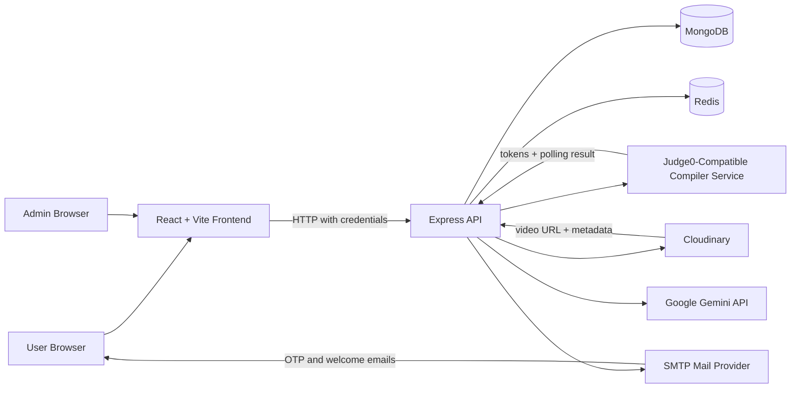

## Folder Structure

```text
Online-Judge-/
  README.md
  backend/
    package.json
    nodemon.json
    src/
      index.js
      config/
        cloudinary.js
        db.js
        redis.js
      controllers/
        aiChatBot.js
        editorialVideo.js
        userAuth.js
        userDashboard.js
        userProblem.js
        userSubmission.js
      cron/
        potdJob.js
      mail_templates/
        emailVerificationTemplate.js
        passwordResetTemplate.js
        registrationConfirmationTemplate.js
      middleware/
        authMiddleware.js
        multerMiddleware.js
        rateLimiter.js
      models/
        editorialModel.js
        otpModel.js
        potdModel.js
        problemModel.js
        submissionModel.js
        userModel.js
      routes/
        aiRouter.js
        editorialRoutes.js
        submitRoutes.js
        userAuth.js
        userProblemRoutes.js
      utils/
        cloudinaryUploader.js
        mailSender.js
        problemUtility.js
        validator.js
  frontend/
    package.json
    vite.config.js
    src/
      App.jsx
      components/
      hooks/
      pages/
      slices/
      store/
      utils/
```

## Tech Stack

| Layer | Technology |
| --- | --- |
| Frontend | React, Vite, React Router, Redux Toolkit |
| UI | Tailwind CSS, DaisyUI, Framer Motion, React Icons |
| Code editor | Monaco Editor |
| Backend | Node.js, Express |
| Database | MongoDB, Mongoose |
| Auth | JWT cookie auth, bcrypt password hashing |
| Cache/blocklist | Redis |
| Compiler | Self-hosted Judge0-compatible compiler service |
| Video | Cloudinary signed uploads |
| Email | Nodemailer SMTP |
| AI | Google Gemini |
| Validation/forms | React Hook Form, Zod, validator |

## Environment Variables

Create `backend/.env`:

```env
PORT=3000
MONGO_URI=mongodb://127.0.0.1:27017/online-judge
JWT_SECRET_KEY=replace_with_a_strong_secret

REDIS_HOST=127.0.0.1
REDIS_PORT=6379
REDIS_USERNAME=
REDIS_PASSWORD=

COMPILER_BASE_URL=http://localhost:8000
MY_COMPILER_SECRET=replace_with_compiler_secret

CLOUDINARY_CLOUD_NAME=replace_with_cloud_name
CLOUDINARY_API_KEY=replace_with_cloudinary_api_key
CLOUDINARY_API_SECRET=replace_with_cloudinary_api_secret

MAIL_HOST=smtp.gmail.com
MAIL_PORT=587
MAIL_SECURE=false
MAIL_USER=replace_with_sender_email
MAIL_PASS=replace_with_app_password

GEMINI_KEY=replace_with_gemini_api_key
```

Create `frontend/.env` or `frontend/.env.production`:

```env
VITE_API_URL=http://localhost:3000
```

Do not commit real secrets to a public repository.

## Local Setup

### Prerequisites

- Node.js
- npm
- MongoDB running locally or a MongoDB Atlas URI
- Redis running locally or hosted Redis credentials
- Compiler service running at `COMPILER_BASE_URL`
- Cloudinary account for editorial videos
- SMTP credentials for OTP and password emails
- Gemini API key for AI tutor

### Install Dependencies

```bash
cd backend
npm install
```

```bash
cd frontend
npm install
```

### Start Backend

```bash
cd backend
npm run dev
```

Default backend URL:

```text
http://localhost:3000
```

### Start Frontend

```bash
cd frontend
npm run dev
```

Default frontend URL:

```text
http://localhost:5173
```

### Start Compiler Service

The online judge expects a Judge0-compatible compiler service:

```text
http://localhost:8000
```

The backend calls:

```text
POST /submissions/batch?base64_encoded=false
GET  /submissions/batch?tokens=<tokens>&base64_encoded=false&fields=*
```

## Application Routes

| Route | Access | Page |
| --- | --- | --- |
| `/` | Public/auth-aware | Landing page or homepage |
| `/login` | Public | Login |
| `/signup` | Public | Signup |
| `/forgot-password` | Public | Forgot password |
| `/reset-password` | Public | Reset password |
| `/problems` | Authenticated | Problem set |
| `/problem/:id` | Authenticated | Problem solving workspace |
| `/submissions` | Authenticated | My submissions |
| `/profile` | Authenticated | Profile |
| `/change-password` | Authenticated | Change password |
| `/contests` | Authenticated | Contest page |
| `/admin` | Admin only | Admin panel |
| `/about` | Public | About |
| `/contact` | Public | Contact |
| `/terms` | Public | Terms of use |
| `/privacy` | Public | Privacy policy |

## Backend API Reference

### Auth and User APIs

Base path: `/user`

| Method | Endpoint | Access | Description |
| --- | --- | --- | --- |
| `POST` | `/sendotp` | Public | Sends signup OTP after checking email and username availability |
| `POST` | `/register` | Public | Registers a user after OTP verification; supports profile photo upload |
| `POST` | `/login` | Public | Logs in with email or username and sets JWT cookie |
| `POST` | `/logout` | Authenticated | Adds JWT to Redis blocklist and clears cookie |
| `GET` | `/check` | Authenticated | Validates current session |
| `GET` | `/profile` | Authenticated | Returns user profile without password |
| `PATCH` | `/update` | Authenticated | Updates profile fields and optional profile photo |
| `DELETE` | `/delete` | Authenticated | Deletes user and submissions |
| `POST` | `/change-password` | Authenticated | Changes password after old password verification |
| `POST` | `/forgot-password` | Public | Sends reset OTP |
| `POST` | `/reset-password` | Public | Resets password with OTP |
| `POST` | `/admin/register` | Admin | Creates another admin |
| `GET` | `/all-admins` | Admin | Lists admins |
| `GET` | `/dashboard-stats` | Authenticated | Returns solved count, submissions, acceptance, created problems |
| `GET` | `/recent-activity` | Authenticated | Returns latest submissions |
| `GET` | `/recent-created-problems` | Admin | Returns latest created problems |

### Problem APIs

Base path: `/problem`

| Method | Endpoint | Access | Description |
| --- | --- | --- | --- |
| `POST` | `/create` | Admin | Validates reference code and creates a problem |
| `PUT` | `/update/:id` | Admin | Validates reference code and updates a problem |
| `DELETE` | `/delete/:id` | Admin | Deletes a problem |
| `GET` | `/all-problems` | Authenticated | Returns compact list of all problems |
| `GET` | `/potd` | Public | Returns current Problem of the Day |
| `GET` | `/solved-problems` | Authenticated | Returns problems solved by current user |
| `GET` | `/submissions/:id` | Authenticated | Returns current user's submissions for a problem |
| `GET` | `/` | Authenticated | Returns filtered/paginated problems |
| `GET` | `/:id` | Authenticated | Returns full problem details and editorial metadata if present |

Supported problem filters:

```text
GET /problem?difficulty=Easy&tags=Array,Math&search=two&page=1&limit=20
```

### Submission APIs

Base path: `/submission`

| Method | Endpoint | Access | Description |
| --- | --- | --- | --- |
| `POST` | `/run/:problemId` | Authenticated | Runs code against visible test cases |
| `POST` | `/run-custom/:problemId` | Authenticated | Runs reference code to generate expected output, then runs user code |
| `POST` | `/submit/:problemId` | Authenticated | Runs code against visible and hidden test cases and saves submission |
| `GET` | `/get-all-submissions` | Authenticated | Returns current user's submissions with pagination |
| `GET` | `/:id` | Authenticated | Returns one submission if it belongs to current user |

Submission request body:

```json
{
  "language": "javascript",
  "code": "console.log('hello')"
}
```

Custom run request body:

```json
{
  "language": "python",
  "code": "print(input())",
  "customInput": "42"
}
```

### Editorial APIs

Base path: `/editorial`

| Method | Endpoint | Access | Description |
| --- | --- | --- | --- |
| `GET` | `/create/:problemId` | Admin | Generates signed Cloudinary upload credentials |
| `POST` | `/save` | Admin | Verifies Cloudinary video and saves editorial metadata |
| `DELETE` | `/delete/:problemId` | Admin | Deletes editorial video and DB record |
| `GET` | `/problem/:problemId` | Authenticated | Gets editorial for a problem |

### AI APIs

Base path: `/ai`

| Method | Endpoint | Access | Description |
| --- | --- | --- | --- |
| `POST` | `/chat` | Authenticated | Sends chat prompt/context to Gemini AI tutor |

## Data Models

### User

Stores identity, role, password hash, optional profile photo, solved problems, and created problems.

Key fields:

- `userName`
- `firstName`
- `lastName`
- `profilePhoto`
- `emailId`
- `role`: `user` or `admin`
- `solvedProblems`
- `createdProblems`
- `password`

### Problem

Stores the complete programming problem.

Key fields:

- `title`
- `description`
- `difficulty`: `Easy`, `Medium`, `Hard`
- `tags`
- `visibleTestCases`
- `hiddenTestCases`
- `startCode`
- `referenceCode`
- `problemCreator`

### Submission

Stores a user's final submitted solution and result.

Key fields:

- `userId`
- `problemId`
- `code`
- `language`
- `status`: `pending`, `accepted`, `wrong answer`, `error`
- `runtime`
- `memory`
- `errorMessage`
- `testCasesPassed`
- `totalTestCases`

### Editorial

Stores Cloudinary video metadata for a problem editorial.

Key fields:

- `problemId`
- `userId`
- `cloudinaryPublicId`
- `secureUrl`
- `thumbnailUrl`
- `duration`

### ProblemOfTheDay

Stores the selected daily problem.

Key fields:

- `problem`
- `date`

### OTP

Stores email OTPs with a TTL expiry of 5 minutes.

Key fields:

- `emailId`
- `otp`
- `createdAt`

## Flow Diagrams

### Signup Flow

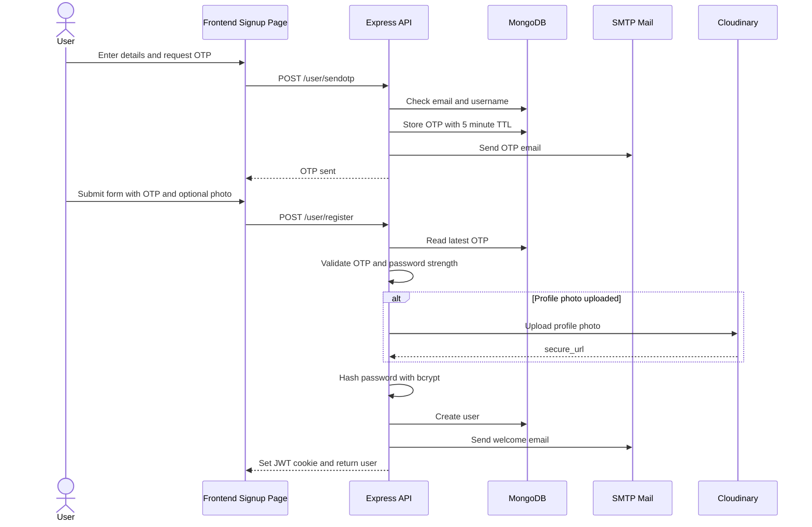

### Login Flow

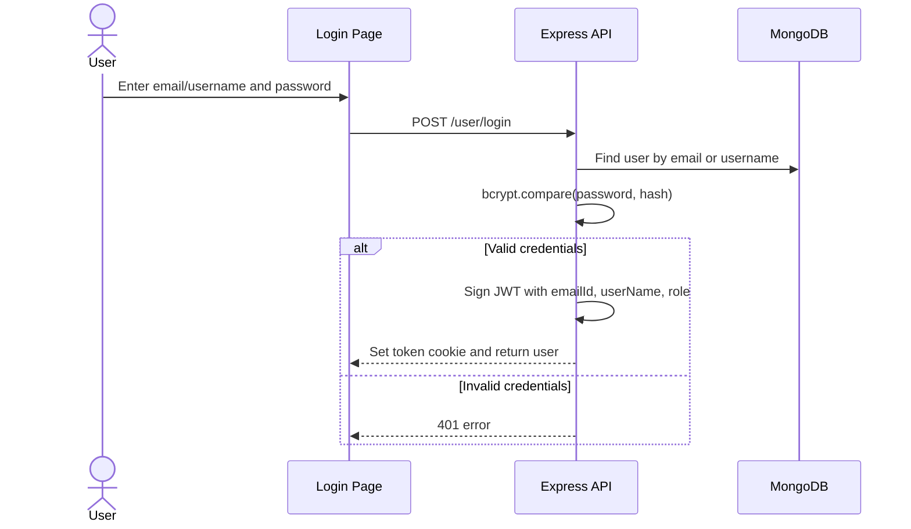

### Auth Check and Route Guard Flow

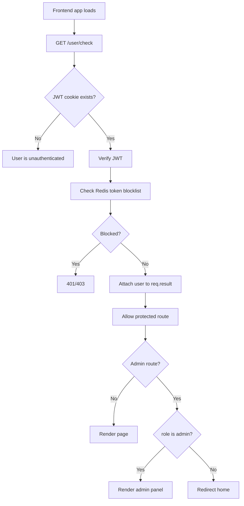

### Logout Flow

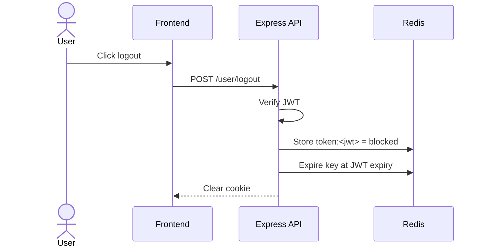

### Forgot and Reset Password Flow

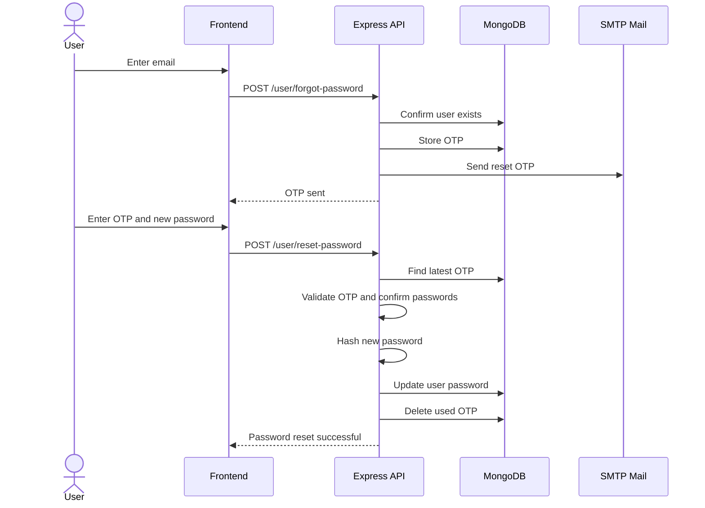

### Admin Create Problem Flow

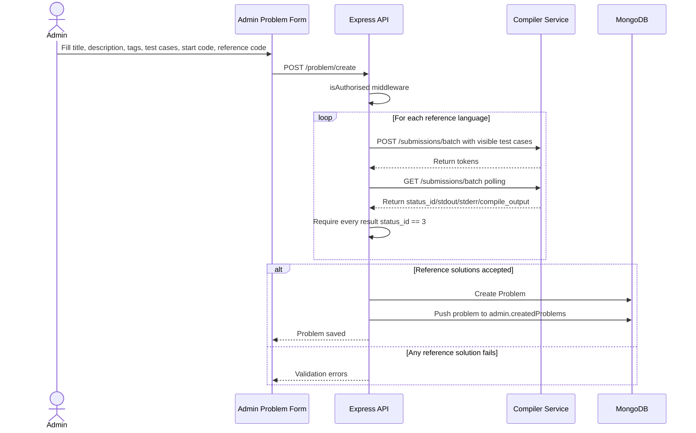

### Admin Update and Delete Problem Flow

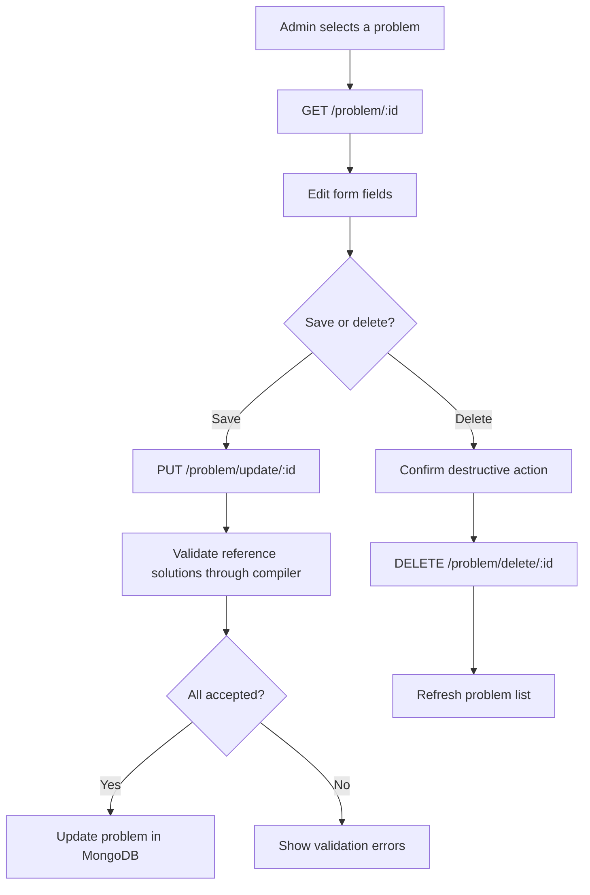

### Problem Browsing Flow

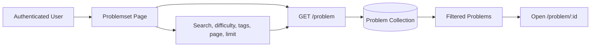

### Problem Solving Workspace Flow

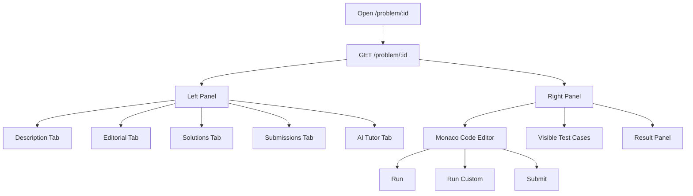

### Run Code Flow

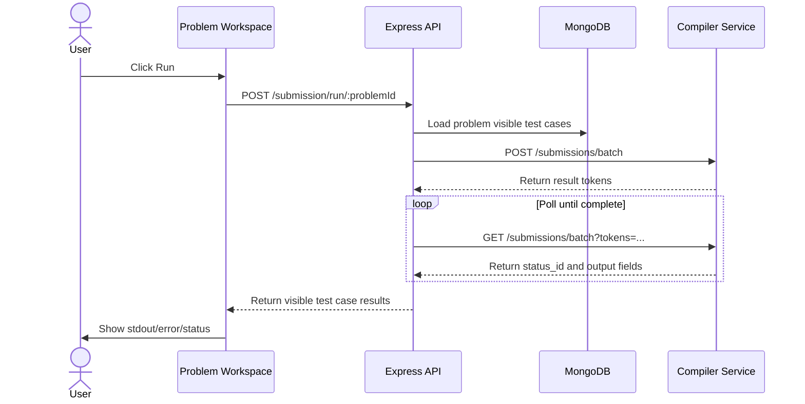

### Custom Run Flow

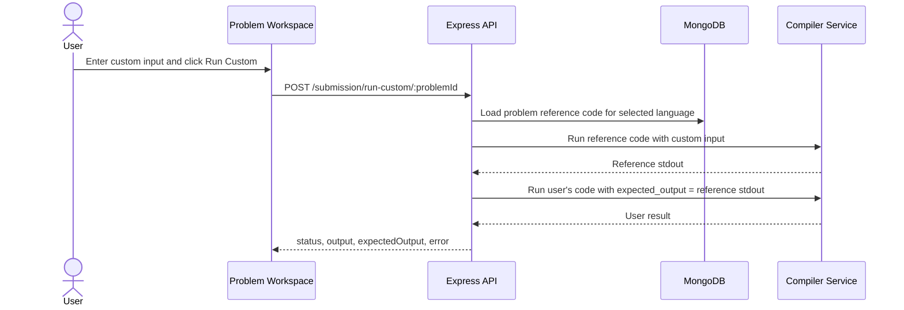

### Final Submission Flow

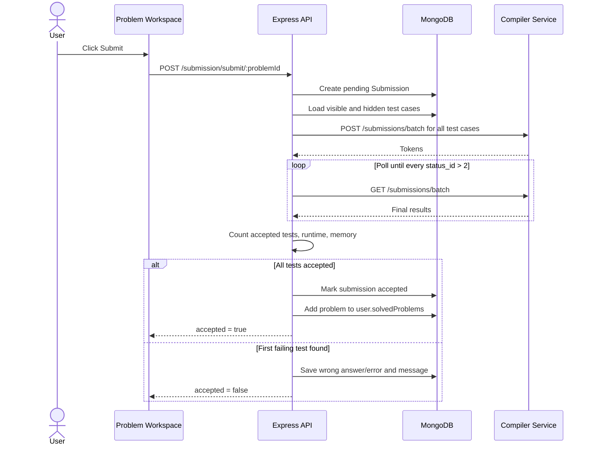

### My Submissions Flow

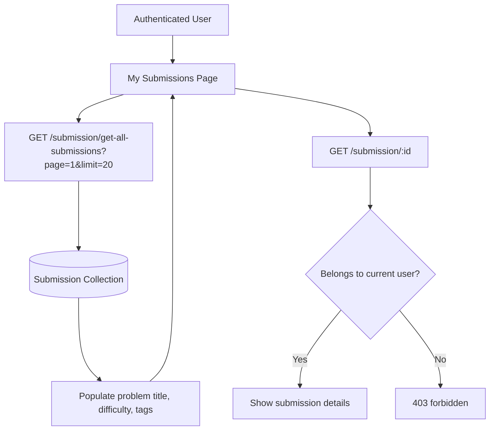

### Editorial Video Upload Flow

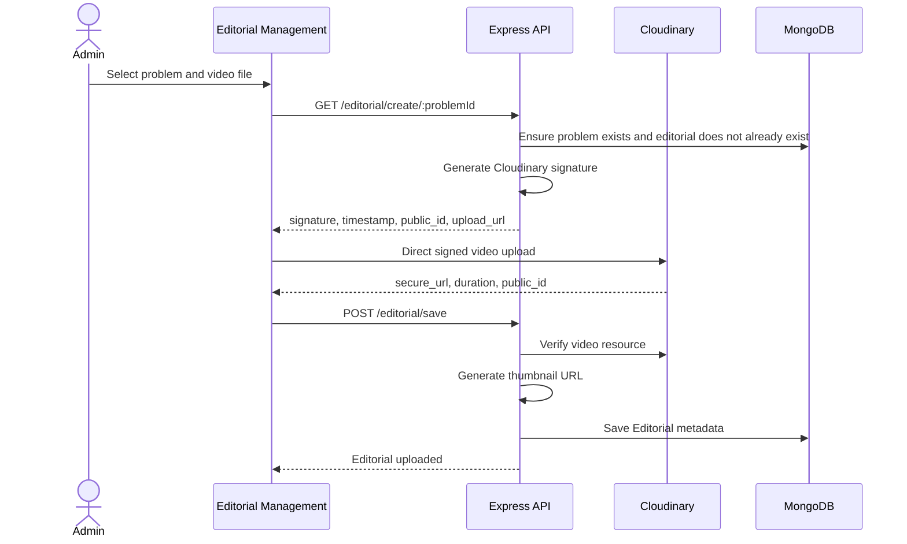

### Editorial Viewing Flow

```mermaid
flowchart LR
  User[Authenticated User] --> ProblemPage[/problem/:id]
  ProblemPage --> API[GET /editorial/problem/:problemId]
  API --> DB[(Editorial Collection)]
  DB --> Exists{Editorial exists?}
  Exists -- Yes --> Video[Return secureUrl, thumbnail, duration, author]
  Exists -- No --> Empty[Return 404 no editorial found]
```

### Problem of the Day Flow

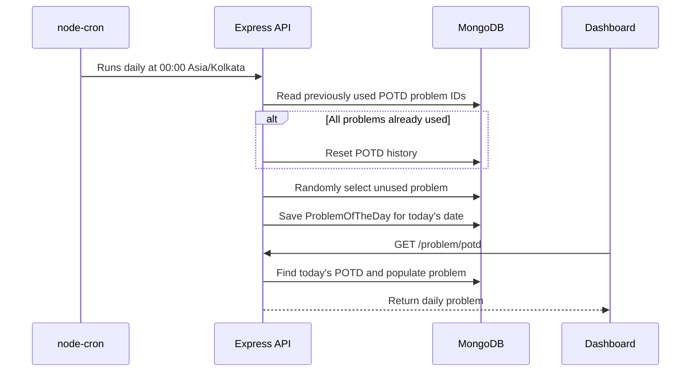

### Dashboard Flow

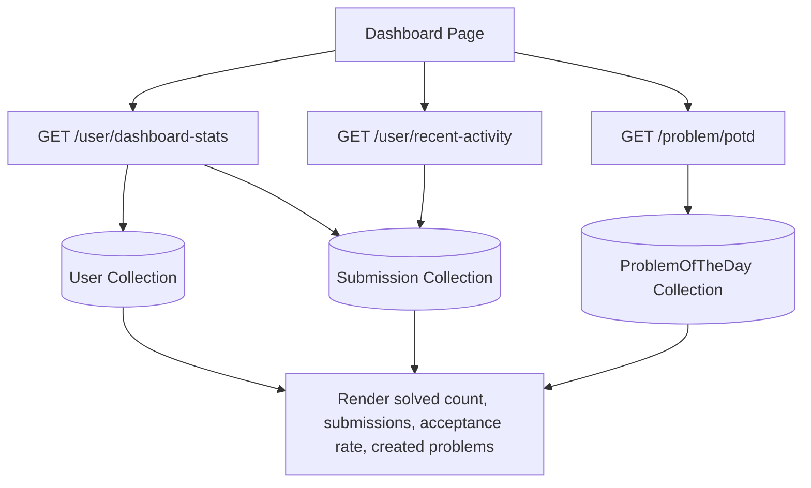

### Profile Update Flow

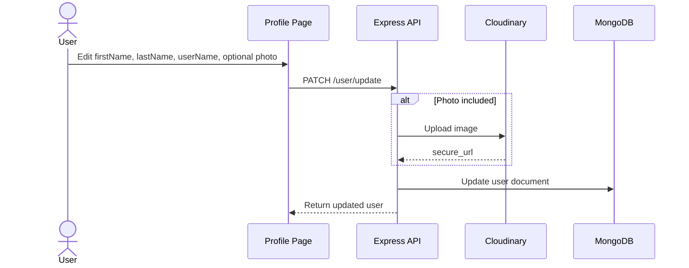

### AI Tutor Flow

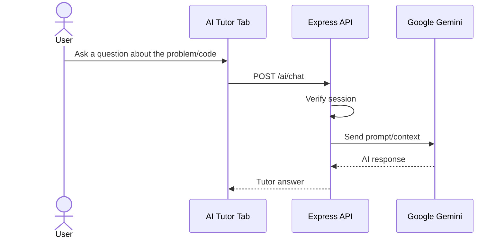

## Judge0-Compatible Compiler Integration

The online judge does not execute code directly. It sends code to a separate compiler service that behaves like Judge0.

### Compiler Base URL

Configured by:

```env
COMPILER_BASE_URL=http://localhost:8000
```

### Compiler Auth

For batch submission creation, the backend sends:

```text
X-Auth-Token: MY_COMPILER_SECRET
```

Polling can be public on the compiler service. This project polls without requiring the auth header.

### Language Mapping

| App language | Compiler language_id |
| --- | --- |
| `c` | `50` |
| `c++` | `54` |
| `java` | `62` |
| `javascript` | `63` |
| `python` | `109` |

### Expected Compiler Response Fields

The backend expects Judge0-style result objects with:

- `status_id`
- `stdout`
- `stderr`
- `compile_output`
- `time`
- `memory`
- `token`

Because `base64_encoded=false`, `stdout`, `stderr`, and `compile_output` should be plain strings, not Base64 strings.

### Status Mapping

| Judge0 status_id | Meaning in this app |
| --- | --- |
| `1` | pending |
| `2` | processing |
| `3` | accepted |
| `4` | wrong answer |
| `5` | error |
| `6` | error |
| `7-12` | error |
| `13-14` | error |

## Cloudinary Editorial Video Flow

Editorial upload is a two-step process:

1. Backend signs an upload request using Cloudinary API secret.
2. Frontend uploads video directly to Cloudinary.
3. Frontend sends returned metadata back to backend.
4. Backend verifies the uploaded Cloudinary resource and stores metadata in MongoDB.

This avoids sending large video files through the Express server.

## Problem of the Day

POTD is selected by `backend/src/cron/potdJob.js`.

- Schedule: `0 0 * * *`
- Timezone: `Asia/Kolkata`
- Selection: random problem that has not been used before.
- Reset behavior: if every problem has already been used, POTD history is cleared and selection starts again.

## Security and Auth

- Passwords are hashed with bcrypt.
- Auth uses JWT stored in cookies.
- Protected requests use `withCredentials: true` from Axios.
- Logout stores the current token in Redis as a blocklisted token.
- Admin routes require both a valid token and `role === "admin"`.
- OTP documents expire after 5 minutes.
- Cloudinary uploads use signed upload parameters.
- Compiler batch POST uses `X-Auth-Token`.

## Common Troubleshooting

### Frontend cannot call backend

Check:

- `frontend/.env` has the correct `VITE_API_URL`.
- Backend CORS origin matches the frontend URL.
- Axios uses `withCredentials: true`.
- Backend is running on `PORT`.

### Login succeeds but protected pages redirect

Check:

- Browser is accepting cookies.
- Backend and frontend origins are compatible with cookie settings.
- `JWT_SECRET_KEY` is the same across backend restarts.
- Redis is not incorrectly blocklisting a fresh token.

### Submissions stay pending

Check:

- Compiler service is running at `COMPILER_BASE_URL`.
- `MY_COMPILER_SECRET` matches the compiler service secret.
- `POST /submissions/batch` returns tokens.
- `GET /submissions/batch?tokens=...&base64_encoded=false&fields=*` eventually returns `status_id > 2`.
- Compiler worker/executor is running.

### Wrong output comparison

Check:

- Compiler output does not include ANSI color codes.
- `base64_encoded=false` is being used.
- Expected output and actual output normalize whitespace as intended by the compiler service.

### Problem creation fails

Problem creation validates reference solutions before saving. Check:

- Every reference solution compiles.
- Every reference solution passes visible test cases.
- Language names match the allowed values exactly:
  - `c++`
  - `java`
  - `python`
  - `c`
  - `javascript`

### Editorial upload fails

Check:

- Cloudinary env vars are correct.
- Selected problem exists.
- There is not already an editorial for the selected problem.
- The uploaded file is a video.
- `POST /editorial/save` receives `problemId`, `cloudinaryPublicId`, `secureUrl`, and `duration`.

## Useful Commands

Backend:

```bash
cd backend
npm install
npm run dev
```

Frontend:

```bash
cd frontend
npm install
npm run dev
```

Build frontend:

```bash
cd frontend
npm run build
```

Lint frontend:

```bash
cd frontend
npm run lint
```

## Notes for Deployment

- Deploy frontend and backend with matching API URLs and CORS origins.
- Use managed MongoDB and Redis in production.
- Deploy the compiler service separately and set `COMPILER_BASE_URL`.
- Keep `MY_COMPILER_SECRET` private and identical between online judge backend and compiler service.
- Configure Cloudinary and SMTP credentials in production environment variables.
- Never expose backend `.env` values in frontend code.
